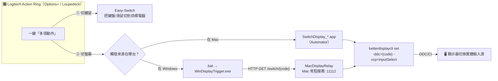

# BetterDisplay × Logitech Action Ring — 進階 KVM 切換方案

> 搭配本程式，使用 [BetterDisplay](https://github.com/waydabber/BetterDisplay)，可利用 **Logitech Action Ring** 的觸發呼叫，**同步切換螢幕輸入源（display source）與鍵盤滑鼠（Easy-Switch）**，達到進階 KVM 效果。

一個按鍵動作，同時做兩件事：

1. **切螢幕** — 透過 BetterDisplay 對顯示器下 DDC/CI `inputSelect` 指令，切換實體輸入源（DP / HDMI / Type-C）。
2. **切鍵鼠** — 透過 Logitech Easy-Switch，把同一組鍵盤、滑鼠切換到目標電腦。

於是「螢幕看哪一台、鍵鼠控哪一台」一次到位，不必手動按顯示器 OSD、也不必另外按鍵鼠上的切換鍵——這就是進階 KVM 的核心體驗。

> 💡 **重點**：`betterdisplaycli` 只能跑在 macOS 上，Windows 無法直接對顯示器下 DDC 指令。本專案的解法是讓 **Mac 端跑一支常駐服務（server），開放區域網路 API 給 Windows 端呼叫**，由 Mac 代為執行螢幕切換。詳見 [運作原理](#運作原理)。

---

## 目錄

- [運作原理](#運作原理)
- [實測拓撲](#實測拓撲作者已實作兩台-mac--一台-pc)
- [元件總覽](#元件總覽)
- [系統需求](#系統需求)
- [安裝與設定](#安裝與設定)
  - [步驟 0：安裝 BetterDisplay 與 betterdisplaycli（brew）](#步驟-0安裝-betterdisplay-與-betterdisplaycli-brew)
  - [步驟 1：Mac 端 — MacDisplayRelay（server）](#步驟-1mac-端--macdisplayrelayserver)
  - [步驟 2：Windows 端 — WinDisplayTrigger](#步驟-2windows-端--windisplaytrigger)
  - [步驟 3：Mac 本機觸發 — Automator App](#步驟-3mac-本機觸發--automator-app)
  - [步驟 4：Logitech Action Ring 設定（匯入 Logi_ring.lp5）](#步驟-4logitech-action-ring-設定匯入-logi_ringlp5)
- [輸入源代碼對照](#輸入源代碼對照)
- [API 文件](#api-文件)
- [設定檔說明](#設定檔說明)
- [開機自動啟動（launchd）](#開機自動啟動launchd)
- [發行與建置](#發行與建置)
- [疑難排解](#疑難排解)
- [參與貢獻](#參與貢獻)
- [授權](#授權)

---

## 運作原理



關鍵在於 **Windows 沒有 BetterDisplay**：

- 在 **Mac** 上要切螢幕 → Logitech Ring 直接跑 `SwitchDisplay_*.app`，本機呼叫 `betterdisplaycli`。
- 在 **Windows** 上要切螢幕 → Logitech Ring 跑對應 `.bat`，由 `WinDisplayTrigger.exe` 透過 HTTP 呼叫 **Mac 上的 `MacDisplayRelay`**，再由 Mac 代為執行 `betterdisplaycli`。

無論觸發來源是哪台，最終都是由 macOS 端對顯示器下 DDC 指令切換輸入源；同一個 Ring 動作再搭配 Easy-Switch 切鍵鼠，達成同步。

---

## 實測拓撲（作者已實作：兩台 Mac + 一台 PC）

作者實際部署環境為 **兩台 Mac 與一台 Windows PC**，三台機器共用同一台顯示器與同一組 Logitech 鍵鼠：

```
                 ┌──────────────────────────┐
                 │   顯示器（多輸入源）       │
                 │  DP / HDMI / Type-C       │
                 └────────────┬─────────────┘
            DDC/CI inputSelect │ （由 Mac 端執行）
        ┌────────────┬─────────┴────────────┐
        │            │                      │
   ┌────┴────┐  ┌────┴────┐           ┌─────┴─────┐
   │  Mac A  │  │  Mac B  │           │ Windows PC│
   │ Relay   │  │ Relay   │           │ Trigger   │
   │ + App   │  │ + App   │           │ + .bat    │
   └─────────┘  └─────────┘           └───────────┘
        ▲            ▲                      ▲
        └────────────┴──────────┬───────────┘
                                │
                  ┌─────────────┴─────────────┐
                  │ Logitech 鍵鼠 + Action Ring│
                  │ Easy-Switch 在三台間切換   │
                  └───────────────────────────┘
```

- 每台 **Mac** 安裝 `MacDisplayRelay`（server）並可放置 `SwitchDisplay_*.app` 供本機 Ring 觸發。
- **Windows PC** 安裝 `WinDisplayTrigger`，以 `.bat` 呼叫對應 Mac 的 Relay 服務。
- 同一組 **Logitech 鍵鼠**透過 Easy-Switch 在三台之間切換，Action Ring 將「切螢幕 + 切鍵鼠」綁成一鍵。

> 你可以依自己的機器數量增減；只要每台 Mac 都跑 Relay、每台 Windows 都裝 Trigger，就能擴充。

---

## 元件總覽

| 元件 | 平台 | 角色 | 說明 |
| --- | --- | --- | --- |
| **MacDisplayRelay** | macOS | Server | ASP.NET Core Minimal API，監聽 `:11112`，提供 `GET /switch/{code}`，呼叫 `betterdisplaycli` 切換輸入源。可裝成 launchd 開機服務。 |
| **WinDisplayTrigger** | Windows | Client | .NET Console，透過 HTTP 呼叫 Mac 端 Relay。搭配 `DP.bat` / `HDMI1.bat` / `TypeC.bat` 三個批次檔對應不同輸入源。 |
| **SwitchDisplay_*.app** | macOS | 本機觸發 | 三個 Automator App（DP / HDMI1 / TypeC），直接在 Mac 本機呼叫 `betterdisplaycli`，供 Mac 上的 Ring 觸發。 |
| **Logi_ring.lp5** | Logi Options+ | 設定檔 | 作者的 Logitech / Loupedeck Action Ring 設定檔備份，含「KVM」資料夾、多項動作與 Easy-Switch 設定，可直接匯入參考。 |

---

## 系統需求

### Mac 端
- macOS
- [BetterDisplay](https://github.com/waydabber/BetterDisplay) 與 `betterdisplaycli`
- .NET 8.0 SDK（開發/自行建置時）或直接使用自包含發行版本
- 顯示器支援 DDC/CI（多數外接螢幕皆支援）

### Windows 端
- Windows x64
- .NET 8.0 Runtime（若使用 `SelfContained=false`）或自包含發行版本

### 周邊
- 支援 **Logitech Options+**（或 Loupedeck）且具 **Action Ring** 的鍵盤／滑鼠（如 MX 系列）
- 支援 **Easy-Switch** 多裝置切換的鍵鼠

---

## 安裝與設定

### 步驟 0：安裝 BetterDisplay 與 betterdisplaycli（brew）

本專案依賴 `betterdisplaycli` 對顯示器下 DDC 指令。**請先在每一台 Mac 上安裝**：

```bash
# 安裝 BetterDisplay 主程式（GUI）
brew install --cask betterdisplay

# 安裝 betterdisplaycli（命令列工具）
brew install waydabber/betterdisplay/betterdisplaycli
```

> 若尚未安裝 Homebrew，請先參考 <https://brew.sh> 安裝。

安裝後驗證：

```bash
# 預設安裝路徑（Apple Silicon）
which betterdisplaycli          # 應顯示 /opt/homebrew/bin/betterdisplaycli

# 查出你的顯示器名稱（後面設定會用到）
betterdisplaycli get -identifiers

# 手動測試切換（請把顯示器名稱與 ddc 代碼換成你自己的）
betterdisplaycli set -n="MPG322UX OLED" -ddc=15 -vcp=inputSelect
```

> ⚠️ Intel Mac 的 Homebrew 路徑通常為 `/usr/local/bin/betterdisplaycli`，請於設定檔 `BetterDisplay:CliPath` 調整。

---

### 步驟 1：Mac 端 — MacDisplayRelay（server）

這支服務讓 Windows 端能跨網路請 Mac 代為切換螢幕。

```bash
cd MacDisplayRelay
dotnet run
```

服務會在 `http://0.0.0.0:11112` 啟動。**設定你的顯示器名稱**，編輯 `MacDisplayRelay/appsettings.json`：

```json
{
  "Server": { "Port": 11112 },
  "BetterDisplay": {
    "CliPath": "/opt/homebrew/bin/betterdisplaycli",
    "DisplayName": "MPG322UX OLED"
  }
}
```

> 建議將此服務設為**開機自動啟動**，見 [開機自動啟動（launchd）](#開機自動啟動launchd)。

---

### 步驟 2：Windows 端 — WinDisplayTrigger

從 Mac server 切換顯示器的呼叫端。用法：

```bash
WinDisplayTrigger.exe <TargetIp> <InputCode>
# 例：切到 DisplayPort（DDC 15），Mac server IP 為 192.168.11.6
WinDisplayTrigger.exe 192.168.11.6 15
```

若已在 `WinDisplayTrigger/appsettings.json` 設定 `DefaultTargetIp`，可省略 IP：

```bash
WinDisplayTrigger.exe 15
```

專案已附三個批次檔，方便 Logitech Ring 直接觸發（請把 IP 改成你的 Mac）：

| 批次檔 | 內容 |
| --- | --- |
| `DP.bat` | `WinDisplayTrigger.exe <MacIP> 15` |
| `TypeC.bat` | `WinDisplayTrigger.exe <MacIP> 16` |
| `HDMI1.bat` | `WinDisplayTrigger.exe <MacIP> 17` |

---

### 步驟 3：Mac 本機觸發 — Automator App

`SwitchDisplay_DP.app`、`SwitchDisplay_HDMI1.app`、`SwitchDisplay_TypeC.app` 是三個 Automator 應用，內含一行 `betterdisplaycli` 指令，**直接在 Mac 本機切換**（不經網路）。供 Mac 上的 Logitech Ring 觸發使用。

若要改成你的顯示器，用 Automator 開啟對應 `.app`，修改其中的 `COMMAND_STRING`：

```bash
/opt/homebrew/bin/betterdisplaycli set -n="你的顯示器名稱" -ddc=15 -vcp=inputSelect
```

---

### 步驟 4：Logitech Action Ring 設定（匯入 Logi_ring.lp5）

`Logi_ring.lp5` 是作者的 Logitech Options+（Loupedeck 引擎）Action Ring 設定檔備份，內含一個 **「KVM」資料夾**、對 Macbook / PC / MacMini 的切換動作，以及 **Easy-Switch 2 台裝置**指令。

設定要點：

1. 在 **Logi Options+** 中為鍵盤／滑鼠的某顆按鍵指派 **Action Ring**。
2. 在 Ring 中建立一個 **「多項動作（Multi-action）」**，組合以下兩步：
   - **切螢幕**：Windows → 啟動對應 `.bat`；Mac → 啟動對應 `SwitchDisplay_*.app`。
   - **切鍵鼠**：加入 **Easy-Switch** 動作，切換到目標電腦的通道。
3. 對每一台目標電腦各建立一個 Ring 項目（例如 KVM 資料夾下：Macbook / PC / MacMini）。

> `Logi_ring.lp5` 本身為 ZIP 封裝（含 `ProfileInfo.json` 等），可作為設定的範本參考；不同裝置型號的匯入方式略有差異，請依 Logi Options+ 的設定檔匯入流程操作。

---

## 輸入源代碼對照

`betterdisplaycli ... -ddc={code} -vcp=inputSelect` 中的 `{code}` 為 DDC/CI 的 input source 值。**不同顯示器數值可能不同**，以下為作者實機（MSI MPG322UX OLED）對照：

| 輸入源 | DDC 代碼 | 對應檔案 |
| --- | --- | --- |
| DisplayPort | `15` | `DP.bat` / `SwitchDisplay_DP.app` |
| USB-C / Type-C | `16` | `TypeC.bat` / `SwitchDisplay_TypeC.app` |
| HDMI 1 | `17` | `HDMI1.bat` / `SwitchDisplay_HDMI1.app` |

> 若切換無效，請逐一嘗試常見值（HDMI1=17、HDMI2=18、DP=15、Type-C/DP-alt=16 或 19 等），找出你顯示器的正確代碼。

---

## API 文件

### `GET /switch/{inputCode}`

切換螢幕輸入源。`inputCode` 為整數（DDC 值）。

**成功（200）**

```json
{
  "success": true,
  "inputCode": 15,
  "message": "螢幕輸入源切換成功",
  "output": "..."
}
```

**失敗（500）**

```json
{
  "status": 500,
  "detail": "betterdisplaycli 執行失敗 (ExitCode: 1)\n錯誤訊息: ..."
}
```

快速測試（見 `MacDisplayRelay/MacDisplayRelay.http`）：

```bash
curl http://192.168.11.6:11112/switch/15
```

---

## 設定檔說明

### Mac 端 `MacDisplayRelay/appsettings.json`

| 設定 | 說明 | 預設 |
| --- | --- | --- |
| `Server:Port` | 服務監聽 Port | `11112` |
| `BetterDisplay:CliPath` | `betterdisplaycli` 路徑 | `/opt/homebrew/bin/betterdisplaycli` |
| `BetterDisplay:DisplayName` | 目標顯示器名稱 | `MPG322UX OLED` |

### Windows 端 `WinDisplayTrigger/appsettings.json`

| 設定 | 說明 | 預設 |
| --- | --- | --- |
| `Client:Port` | Mac server 的 Port | `11112` |
| `Client:TimeoutSeconds` | HTTP 逾時秒數 | `5` |
| `Client:DefaultTargetIp` | 預設 Mac IP（設定後可省略命令列 IP） | （空） |

> 若修改了 Mac 端 Port，請同步更新 Windows 端 `Client:Port`。

---

## 快速客製化：換成你的環境只需改這幾處

| 你的環境 | 改哪裡 |
| --- | --- |
| **Mac IP** | Windows 端 `WinDisplayTrigger/_config.bat` 的 `MAC_IP`（三個 .bat 共用，**只改一處**） |
| **顯示器名稱** | `MacDisplayRelay/appsettings.json` 的 `BetterDisplay:DisplayName`；Mac 本機腳本可用環境變數 `BD_DISPLAY` 覆寫 |
| **DDC 輸入源代碼** | 依你的顯示器調整（見上方對照表），改 `.bat` / 腳本中的數字 |
| **betterdisplaycli 路徑** | `BetterDisplay:CliPath`（Intel Mac 多為 `/usr/local/bin/...`），或環境變數 `BD_CLI` |

**免改檔、用環境變數覆寫**：`MacDisplayRelay` 支援以環境變數覆寫設定（雙底線語法），方便在 launchd 或啟動腳本中設定：

```bash
BetterDisplay__DisplayName="DELL U2723QE" Server__Port=11112 ./MacDisplayRelay
```

`switch_pc.sh` 也支援以 `BD_DISPLAY` / `BD_CLI` 覆寫，免改腳本：

```bash
BD_DISPLAY="DELL U2723QE" ./switch_pc.sh 17
```

驗證服務與當前生效設定（根路徑健康檢查）：

```bash
curl http://<MacIP>:11112/
# → {"service":"MacDisplayRelay","status":"running","displayName":"...","port":11112,...}
```

---

## 開機自動啟動（launchd）

讓 `MacDisplayRelay` 在每台 Mac 開機時自動於背景常駐。

```bash
cd MacDisplayRelay

# 1. 先發行（自包含，免裝 runtime）
dotnet publish -c Release -r osx-$(uname -m) -p:PublishSingleFile=true -p:SelfContained=true

# 2. 安裝為 launchd 服務
./install-service.sh
```

安裝腳本會把執行檔複製到 `/usr/local/bin/`、安裝 plist 到 `~/Library/LaunchAgents/`、並立即啟動。

常用管理指令：

```bash
launchctl start net.kenghua.macdisplayrelay     # 啟動
launchctl stop  net.kenghua.macdisplayrelay     # 停止
launchctl list | grep net.kenghua.macdisplayrelay   # 狀態
tail -f ~/Library/Logs/MacDisplayRelay/stdout.log   # 日誌

# 卸載
./uninstall-service.sh
```

---

## 發行與建置

```bash
# 建置整個方案
dotnet build BetterDisplayKVM.sln

# Mac 端發行（Apple Silicon）
cd MacDisplayRelay
dotnet publish -c Release -r osx-arm64 -p:PublishSingleFile=true -p:SelfContained=true
# Intel Mac 改用 -r osx-x64

# Windows 端發行（自包含，免裝 .NET）
cd WinDisplayTrigger
dotnet publish -c Release -r win-x64 -p:PublishSingleFile=true -p:SelfContained=true
```

發行檔位置：
- Mac：`MacDisplayRelay/bin/Release/net8.0/osx-{arch}/publish/MacDisplayRelay`
- Win：`WinDisplayTrigger/bin/Release/net8.0/win-x64/publish/WinDisplayTrigger.exe`

---

## 疑難排解

| 症狀 | 可能原因與處理 |
| --- | --- |
| 切換無反應、`ExitCode: 1` | 顯示器名稱（`DisplayName`）或 DDC 代碼不對；用 `betterdisplaycli get -identifiers` 確認名稱，逐一試 DDC 值。 |
| Windows 端「無法連接」 | 兩台不在同網段、Mac 防火牆擋了 `:11112`、或 Relay 未啟動；確認 IP、放行 Port。 |
| Port 已被占用 | 改 `Server:Port` 並同步 Windows 端 `Client:Port`。 |
| 找不到 `betterdisplaycli` | 確認 brew 已安裝，並把 `BetterDisplay:CliPath` 指向正確路徑（Intel Mac 為 `/usr/local/bin/...`）。 |
| 服務沒開機啟動 | 確認 `launchctl list | grep net.kenghua.macdisplayrelay` 有列出；重跑 `install-service.sh`。 |

---

## 參與貢獻

歡迎一起讓這個進階 KVM 方案更完整！請參考 [CONTRIBUTING.md](CONTRIBUTING.md)。特別歡迎的貢獻方向：

- 補充**其他顯示器型號**的 DDC 輸入源代碼對照。
- 提供**其他周邊**（Stream Deck、其他巨集鍵盤）的觸發設定範例。
- 改善文件、補充英文翻譯，讓更多人能參與。

歡迎開 Issue 回報問題或提出想法，也歡迎送 Pull Request。

---

## 授權

本專案以 [MIT License](LICENSE) 釋出。

---

<details>
<summary>📖 English summary</summary>

**BetterDisplay × Logitech Action Ring — Advanced KVM**

With this project plus [BetterDisplay](https://github.com/waydabber/BetterDisplay), a single **Logitech Action Ring** trigger switches **both the monitor input source and your keyboard/mouse (via Easy-Switch) at the same time** — an advanced KVM experience.

Because `betterdisplaycli` only runs on macOS, Windows can't drive the monitor's DDC directly. The fix: a small **server runs on the Mac (`MacDisplayRelay`, port 11112)** exposing `GET /switch/{ddcCode}` over the LAN, so the **Windows client (`WinDisplayTrigger`)** can ask the Mac to switch the display. On macOS the Ring triggers Automator apps locally instead.

The author runs this across **two Macs and one Windows PC** sharing one monitor and one Logitech keyboard/mouse set. See the sections above for setup; install the CLI with `brew install waydabber/betterdisplay/betterdisplaycli`. Contributions welcome — see [CONTRIBUTING.md](CONTRIBUTING.md).

</details>
